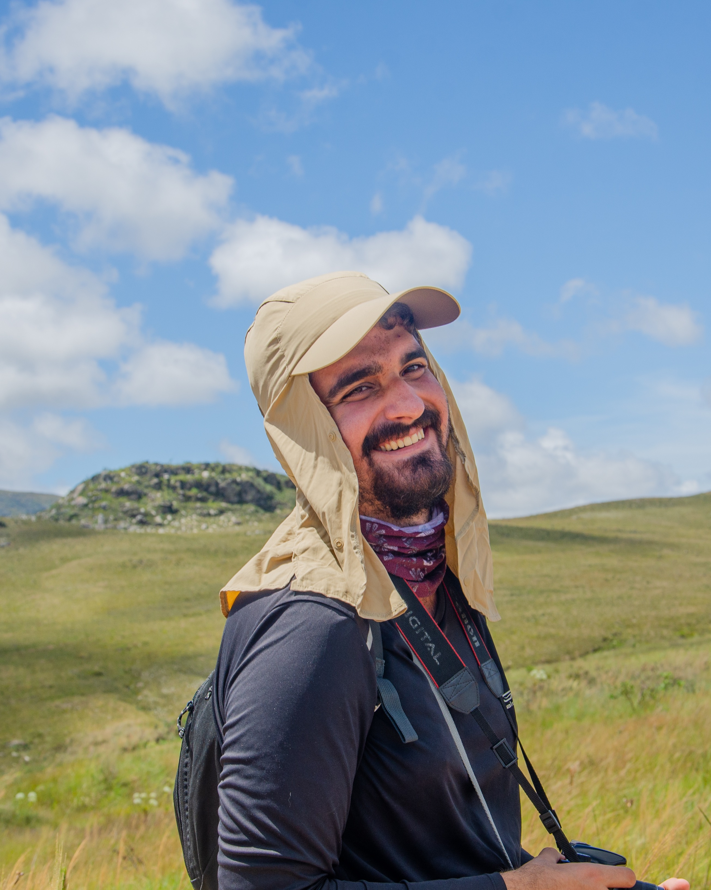

:::: {style="display: flex;"}

::: {}

I'm a seed ecologist from Colombia and I hold a BSc.degree in both Ecology (2018) and Biology (2019) from Pontificia Universidad Javeriana (Bogotá D.C., Colombia) and an MSc. in Plant Biology (2022) from Universidade Federal de Minas Gerais (Belo Horizonte, Brazil).

I became interested in seed ecology early in my studies when I got involved with Dr Sofía Basto's research. While in her lab, I worked on different topics of seed ecology, including soil seed banks and germination studies. In fact, Dr Basto was the supervisor for my Undergraduate research project, where I worked on the temporal dynamic of the seed rain in a tropical dry forest of the Magdalena River Valley (Colombia).

After that, I moved to Belo Horizonte (Brasil) to join the Centre of Ecological Synthesis and Conservation at Universidade Federal de Minas Gerais and do my MSc with Dr Fernando A. O. Silveira. Since my arrival, I've worked more deeply in seed germination ecology and learned about quantitative synthesis and comparative phylogenetic methods. Moreover, we've been working around the awareness and the biases that exist towards open ecosystems –such as savannas, grasslands and shrublands.

Besides seed ecology, I'm interested in science decolonisation and how we can make science and its practices more inclusive and equitable. I also have adventured in science communication, having prepared different pieces to engage people with seed science, and I'm an enthusiast of data visualisation and photography.

You might find a complete version of my curriculum here, and if you are willing to discuss or collaborate on any of these topics, don't hesitate to contact me!

:::

::: {}

:::

::::