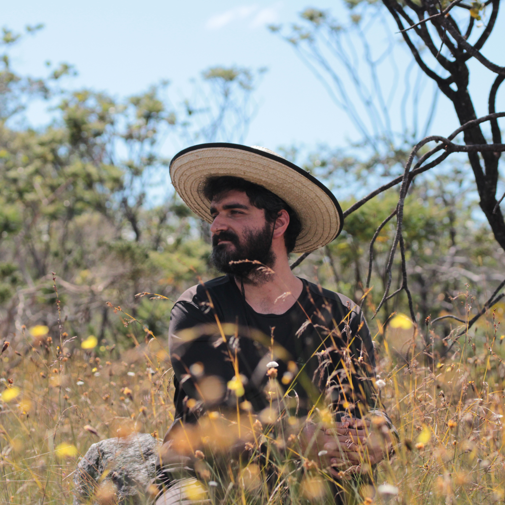
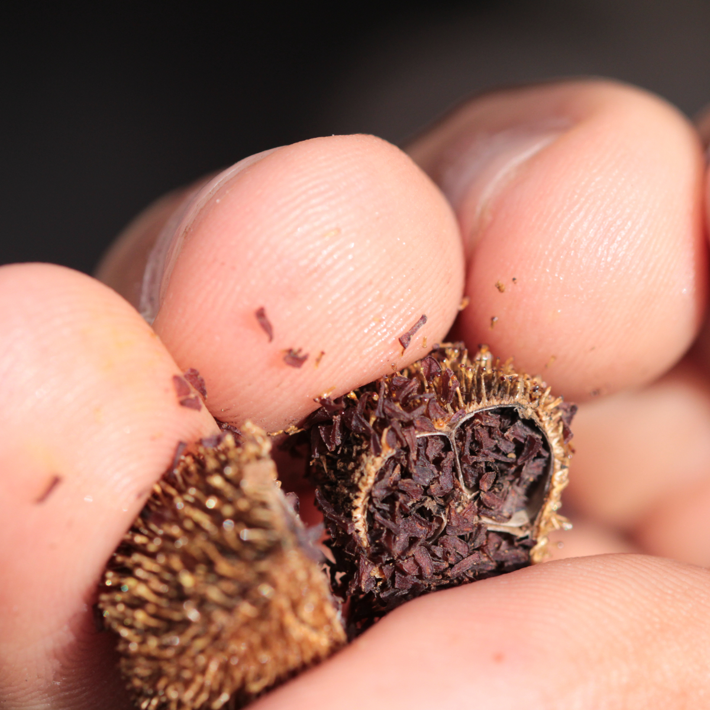
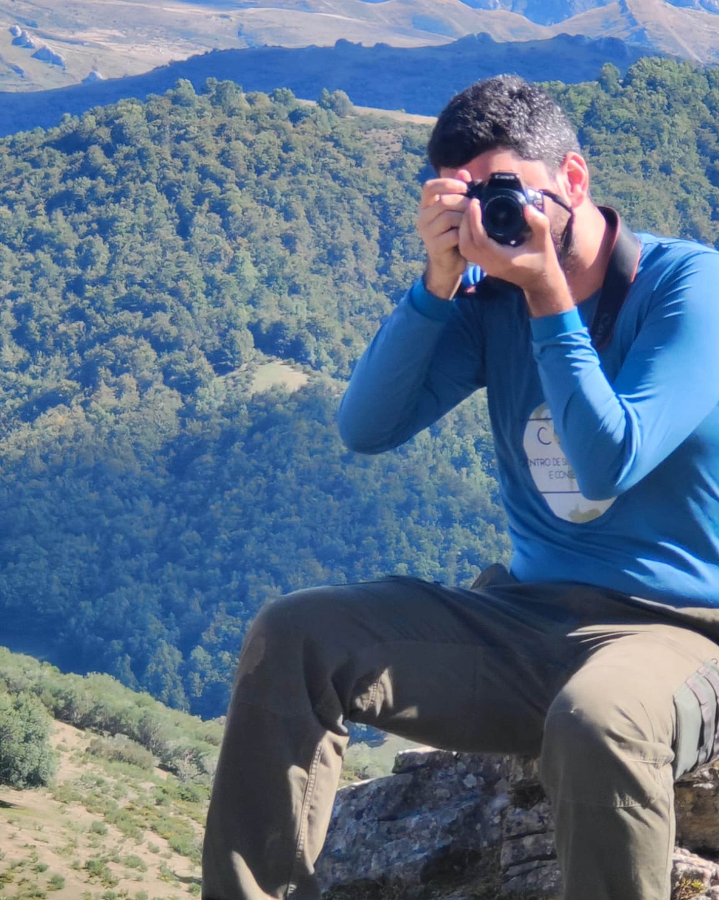

 

<figure>

<figcaption>
Carlos in a _semprevivas_ field in Chapada dos Veadeiros National Park, Goiás, Brazil. Photo by Victor H. D. Silva.
</figcaption>
</figure>

 
 

<figure class="secondary-photo">

<figcaption>
Fruit and seeds of _Vellozia tubiflora_ (Velloziaceae), a widespread species in the Brazilian savannahs. Photo by Victor H. D. Silva.
</figcaption>
</figure>

 
 

<figure class="secondary-photo">

<figcaption>
Carlos during his first fieldwork in Chapada dos Veadeiros National Park. Photo by Yuri Souza.
</figcaption>
</figure>

I am a Colombian seed scientist with a BSc in Ecology (2018) and a BSc in Biology (2019) from Pontificia Universidad Javeriana, in Bogotá, Colombia, and an MSc in Plant Biology (2022) from Universidade Federal de Minas Gerais, in Belo Horizonte, Brazil.

My interest in seed ecology began when I joined <a href="https://www.researchgate.net/profile/Sofia-Basto">Dr Sofía Basto’s</a> lab, where I worked on soil seed banks and germination studies. Under her supervision, I carried out my undergraduate research project on the temporal dynamics of seed rain in a tropical dry forest in the Magdalena River Valley, Colombia.

After completing my undergraduate studies, I moved to Brazil to pursue an MSc at the Centre of Ecological Synthesis and Conservation, UFMG, under the supervision of <a href="https://www.researchgate.net/profile/Fernando-Silveira-6">Dr Fernando A. O. Silveira</a>. Since then, I have deepened my focus on seed germination ecology while gaining expertise in quantitative synthesis and phylogenetic comparative methods. For my PhD, also at UFMG, I am combining quantitative synthesis and seed ecophysiology experiments to explore how different germination traits are coordinated with other traits commonly used to define plant ecological strategies.

My ultimate goal as a researcher is to build knowledge about the seeds of tropical ecosystems, with the hope that this information can contribute to their conservation and ecological restoration. Beyond these topics, I am interested in the decolonisation of science and in how scientific practices can become more inclusive and equitable. I have also ventured into <a href="https://caordonezparra.github.io/scicomm.html">science communication</a>, preparing pieces that engage broader audiences with seed science, and I am also enthusiastic about data visualisation.

If you would like to discuss or collaborate on any of these topics, please do not hesitate to <a href="https://caordonezparra.github.io/contact.html">contact me</a>!

