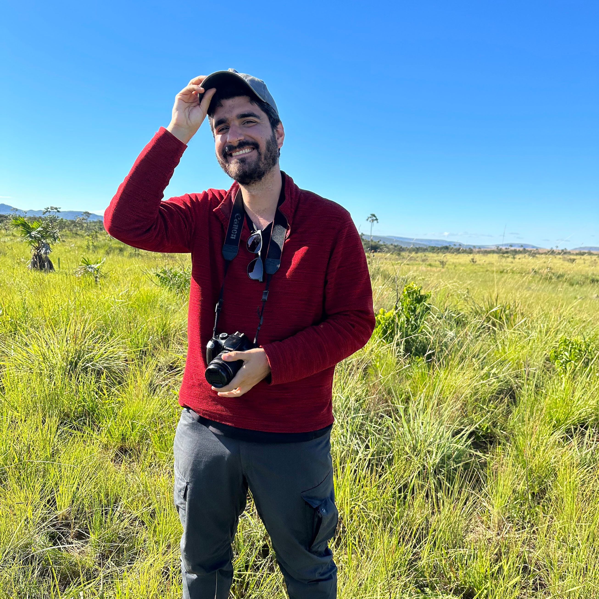

I am a Colombian seed ecologist with a BSc in Ecology (2018) and Biology (2019) from Pontificia Universidad Javeriana (Bogotá, Colombia) and an MSc in Plant Biology (2022) from Universidade Federal de Minas Gerais (Belo Horizonte, Brazil). I am a native Spanish speaker, fluent in English and Portuguese.

My interest in seed ecology began when I joined [Dr Sofía Basto’s](https://www.researchgate.net/profile/Sofia-Basto) lab, where I worked on soil seed banks and germination studies. For instance, it was under her supervision, that I carried my Undergraduate research project focused on the temporal dynamics of seed rain in a tropical dry forest of the Magdalena River Valley, Colombia.

After completing my undergraduate studies, I moved to Brazil to pursue an MSc at the Centre of Ecological Synthesis and Conservation, UFMG, under [Dr Fernando A. O. Silveira]((https://www.researchgate.net/profile/Fernando-Silveira-6)). Since then, I have deepened my focus on seed germination ecology while gaining expertise in quantitative synthesis and phylogenetic comparative methods.

My ultimate goal as a researcher is to build knowdlege around the seeds of tropical ecosystems, hoping that this information can be translated into the conservation, ecological restoration and conservation of tropical ecosystems.Besides these topics, I'm interested in science decolonization and how we can make science and its practices more inclusive and equitable. I also have adventured in [science communication](https://caordonezparra.github.io/scicomm.html), having prepared different pieces to engage people with seed science, and I'm an enthusiast of data visualization.

You might find a complete version of my curriculum [here](https://caordonezparra.github.io/cv.html), and if you are willing to discuss or collaborate on any of these topics, don't hesitate to [contact](https://caordonezparra.github.io/contact.html) me!

 

The face of someone who just met the _campo rupestre_. Photo by Jade Albanaz.

Fieldwork in the Parque Nacional Chapada dos Veaderios (Goiás, Brazil). Photo by Yuri Souza.

