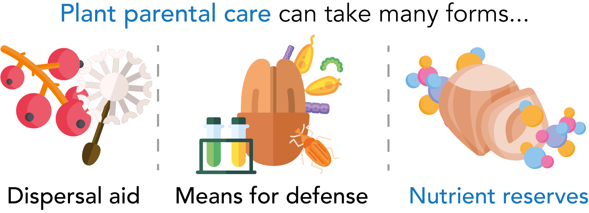
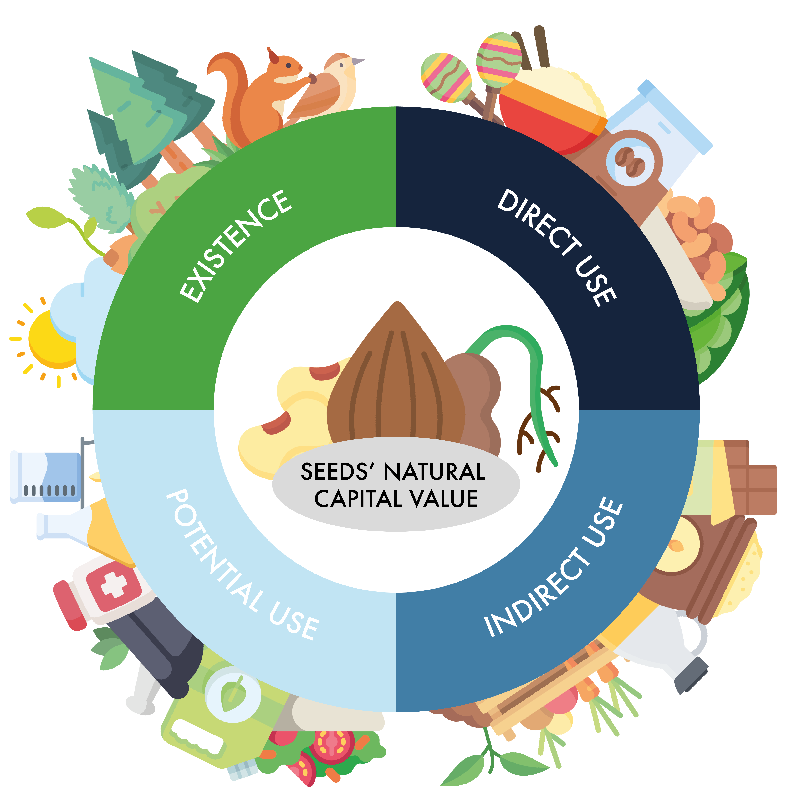
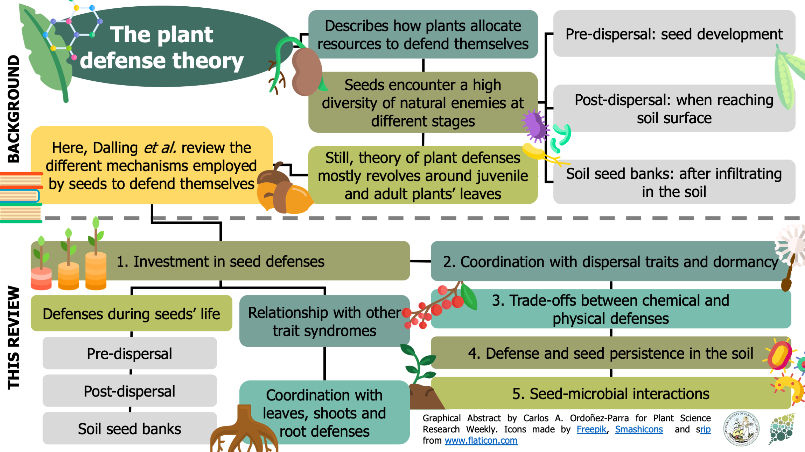
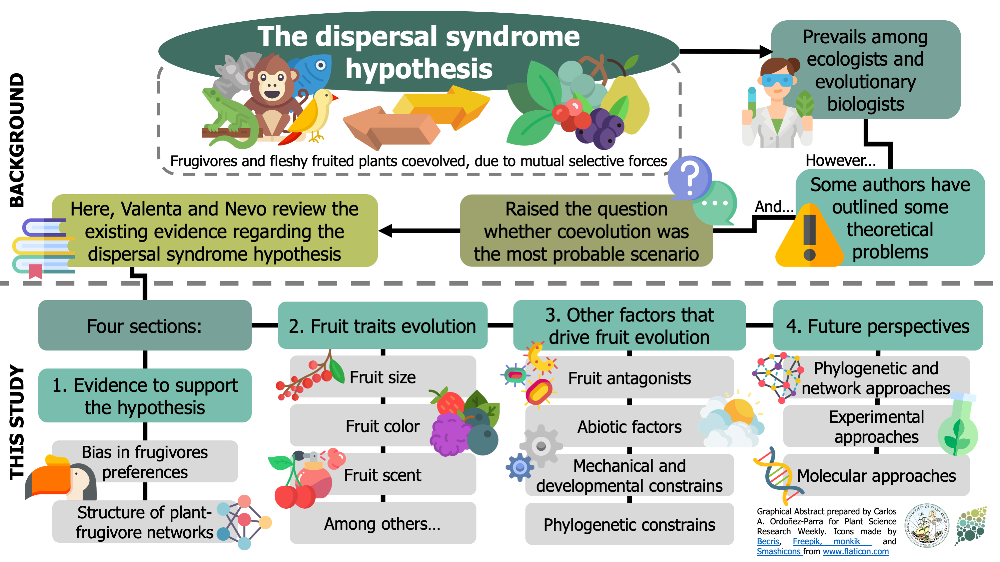

As a seed ecologist, I am concerned about the lack of awareness about seeds and their importance in nature and our societies. Therefore, I've written different kinds of pieces to share recent seed science studies and the researchers. Some of these pieces include graphical abstracts and infographics that pretend to summarise the papers or their key concepts in a more succinct and (hopefully) aesthetic fashion.

If you have an exciting seed science story and want me to write something about it, feel free to [contact me](https://caordonezparra.github.io/contact.html) to discuss it!

 

### BotanyOne articles
[_BotanyOne_](https://botany.one/) is a weblog by the Annals of Botany Company that produces different pieces to share exciting plant science research. I've contributed with guest posts for them, and since April of 2023 I've been serving as a [Scientific Editor](https://botany.one/2023/04/introducing-carlos-andres-ordonez-parra-our-new-science-editor/). Since that moment, I've been able to work with guest authors from different countries and expertises, helping them to create engaging narratives about exciting plant science stories. Below, you'll find some of the papers I've written so far.

> [Turning the Key in Wakehurst’s Vault to Combat Climate Change](https://botany.one/2024/01/turning-the-key-in-wakehursts-vault-to-combat-climate-change/), January 15, 2024. 

> [How to Live on a Hot, Dry Rock: Different Solutions to the Same Problem](https://botany.one/2023/11/how-to-live-on-a-hot-dry-rock-different-solutions-to-the-same-problem/), November 21, 2023 

> [Unlocking the Tiny Secrets to Grow the World’s Largest Flowers](https://botany.one/2023/10/unlocking-the-tiny-secrets-to-grow-the-worlds-largest-flowers/), October 25, 2023.

> [Traitor: Unleashing the Power of Automation for Studying Seed Traits](https://botany.one/2023/06/traitor-unleashing-the-power-of-automation-for-studying-seed-traits/), June 7, 2023.

> [How Do Seeds Save for a Rainy Day?](https://botany.one/2022/05/how-do-seeds-save-for-a-rainy-day/), May 30th, 2022.

> [Plants Don’t Want Their Children to Starve](https://botany.one/2022/03/plants-dont-want-their-children-to-starve/), March 24th, 2022.

<figure>
  
  <figcaption> _Infographic summarising different ways of plant maternal care. The figure uses icons from [Flaticon.com](https://www.flaticon.com/)_ </figcaption>
</figure> 

 

> [Most plants come from seeds. What does this mean for us?](https://botany.one/2021/12/most-plants-come-from-seeds-what-does-this-mean-for-us/), December 15th, 2021.

<figure>
  
  <figcaption> _Infographic summarising the different components of seed's total economic value. The figure uses icons from [Flaticon.com](https://www.flaticon.com/)_ </figcaption>
</figure> 

 

### Plant Science Research Weekly summaries

[Plant Science Research Weekly](https://plantae.org/research/wwrtw/) is the newsletter by Plantae.org -the online community led by the American Society of Plant Biologists- that looks to highlight recent and exciting plant biology research. Since I was a Plantae Fellow (2020), I've written more than 90 summaries about different seed science research, from molecular biology to ecological synthesis. Here you will find a selection of summaries dealling with different topics. You might find the complete list [here](https://plantae.org/author/carlosordonezparra/).

> I edited the [edition](https://plantae.org/plant-science-research-weekly-july-31/) of July 30th, 2020, which included seven papers dealing with seed evolution.

<figure>
  
</figure> 

 

> [Shielding the oil reserves: the scutellum as a source of chemical defenses](https://plantae.org/shielding-the-oil-reserves-the-scutellum-as-a-source-of-chemical-defenses-plant-physiol/). February 18th, 2022.

> [Expression analyses in _Ginkgo biloba_ provide new insights into the evolution and development of the seed](https://plantae.org/expression-analyses-in-ginkgo-biloba-provide-new-insights-into-the-evolution-and-development-of-the-seed-sci-reports/). December 10th, 2021.

> [A prion-like protein regulator of seed germination undergoes hydration- dependent phase separation](https://plantae.org/a-prion-like-protein-regulator-of-seed-germination-undergoes-hydration-dependent-phase-separation-cell/). August 13th, 2021.

> [Experimental evidence of microbial inheritance in plants and transmission routes from seed to phyllosphere and root](https://plantae.org/experimental-evidence-of-microbial-inheritance-in-plants-and-transmission-routes-from-seed-to-phyllosphere-and-root-environ-microbiol/). February 5th, 2021.

> [The process of seed maturation is influenced by mechanical constraints](https://plantae.org/the-process-of-seed-maturation-is-influenced-by-mechanical-constraints-new-phytol/). September 24th, 2020.

> [Extending Plant Defense Theory to Seeds](https://plantae.org/review-extending-plant-defense-theory-to-seeds-annu-rev-ecol-evol-syst/). August 28th, 2020.

<figure>
  
</figure> 

 

> [How animals shaped fruit traits, and how they did not](https://plantae.org/how-animals-shaped-fruit-traits-and-how-they-did-not-funct-ecol/). May 1st,
2020.

<figure>
  
</figure> 

 

### Other works

 

### _Online_

> Ordóñez-Parra CA (2018). Dilvulgación Científica [Radio Interview] Available at: https://bit.ly/38WrQs

> Ordóñez-Parra CA (2018). La ciencia debería importarnos a todos en
Colombia [Open Editorial] Available at: https://bit.ly/35GpITe

 

### _Printed_

> **Ordóñez-Parra CA** & Mancera-Cortés J (2017). Una historia verde que se
cuenta y se escribe en el campus de la Javeriana. Revista Javeriana, 834: 64-67.

> **Ordóñez-Parra CA** & Basto S (2016). El reto de identificar la especie a la cual pertenece una semilla. Revista Javeriana, 830: 60-64.

