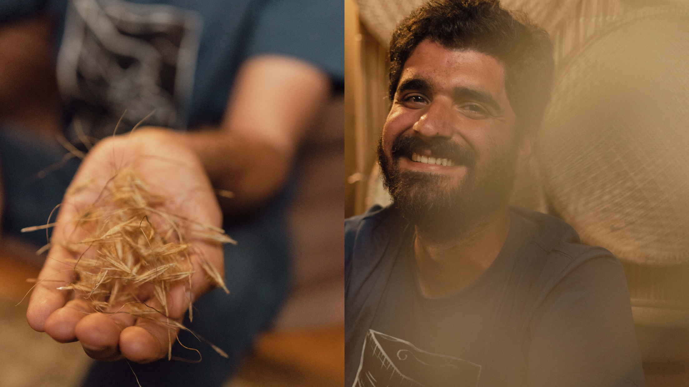

 

<figure style="width: 110%; margin-left: -5%; margin-right: -5%;">
  
</figure> 

 

Hi! My name is [Carlos A. Ordóñez-Parra (he/him)](https://caordonezparra.github.io/about.html), and I am a PhD candidate in the Plant Biology Programme at Universidade Federal de Minas Gerais, in Belo Horizonte, Brazil. On this website, you will find information [about me](https://caordonezparra.github.io/about.html), [my research](https://caordonezparra.github.io/projects.html), [my publications](https://caordonezparra.github.io/publications.html) and my other interests.

I am a seed scientist interested in the functional role of seeds in natural regeneration and community assembly in tropical ecosystems. My work integrates approaches from functional ecology, ecophysiology, phylogenetic comparative methods and ecological synthesis to understand how seeds respond to abiotic factors at the species level, and how these responses shape community-level patterns. 

Beyond research, I am passionate about the decolonisation of science, inclusivity in academia, science communication and data visualisation.

