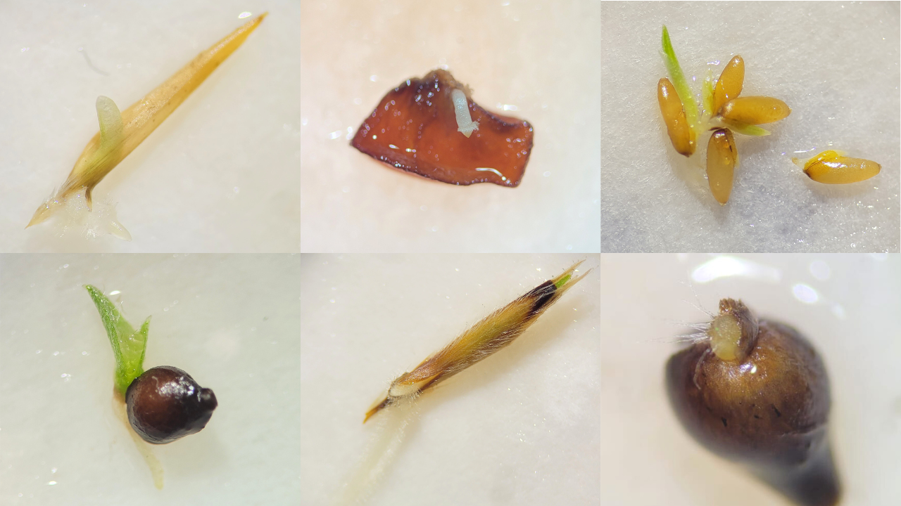

 
Here you'll find information about my academic projects. If you are interested in collaborating or discussing some ideas, feel free to [e-mail me](mailto:carlos.ordonez.parra@gmail.com)!
  

### ECOS-s: A synthesis of Seed Ecology in Colombia (2024 - Ongoing)

 

<figure>
  
</figure> 

 

Seed ecology is a discipline of utmost importance for understanding the dynamics of plant populations and communities, as well as ecosystems and biomes. Therefore, is of vital interest for different practical applications, such as the design and implementation of biodiversity conservation and ecological restoration projects. ECOS-s aims to provide the first synthesis of seed ecology in Colombia through a systematic review and a quantitative assessment of biogeographical, phylogenetic and functional biases. Moreover, we aim to consolidate a database of seed and germination traits of the species studied to date. This project is co-lead by [Diana C. Acosta-Rojas](https://www.researchgate.net/profile/Diana-Acosta-Rojas-2) and me.

 

### To germinate or not germinate: risk-spreading strategies meet seed germination traits (2023 - Ongoing)

 

<figure>
  
  <figcaption> _Germinating seeds from emblematic families of the Brazilian Cerrado._ </figcaption>
</figure> 

 

Seed ecologists propose that strong evolutionary pressure ensures germination occurs only under conditions favourable for seedling establishment and survival. However, germination traits have been largely overlooked in the plant ecological strategies theory—a key framework that explains how plant species persist across different environments through distinct trait combinations. During my PhD, I'll explore into how various germination traits are coordinated with other plant traits known to shape plant ecological strategies. This projects combines quantitative synthesis of secondary data and laboratory and field experiments in the Brazilian Cerrado -the largest Neotropical savannah and the one with most species worldwide.

 

### Rock n' Seeds: an ecological synthesis of seed germination in rock outcrop vegetation (2020 - Ongoing)

 

<figure>
  
  <figcaption> _Quartzitic outcrops at Serra do Cipó (Minas Gerais, Brazil)._ </figcaption>
</figure> 

 

As part of my Master's Dissertation, I compiled a database of 16 seed functional traits from Brazilian rock oucrop vegetation -including ecosystems locally known as _campo rupestre_, _canga_, _campo de altitude_ and inselbergs- that has been published as a [data paper](https://esajournals.onlinelibrary.wiley.com/doi/abs/10.1002/ecy.3852) in _Ecology_. With this database, I lead [the first quantitative synthesis](https://doi.org/10.1093/aob/mcae160) of seed ecology in these ecosystems, focusing on the phylogenetic structure of seed traits and germination responses to different abiotic factors.

Being outcrops a geological formation that founds in every climate and continent, we plan to expand our database and quantitative synthesis to other rock outcrop vegetation worldwide.

 

### MelastomaTraits: a trait database for the Melastomataceae family, a megadiverse tropical clade (2020 - 2024)

 

<figure>
  
  <figcaption> _Meriania longifolia at the campus of Pontificia Universidad Javeriana (Bogotá D.C., Colombia)._ </figcaption>
</figure> 

 

The Melastomataceae family is among the ten largest botanical families in the world, and its widely recognized for its wide morphological and functional diversity. In this project, we compiled a database of plant traits from different organs, including leaves, flowers, fruits and seeds, based on data collected for various chapters of the recent publication [_Systematics, Evolution, and Ecology of Melastomataceae_](https://link.springer.com/book/10.1007/978-3-030-99742-7). The database is available a [data paper](https://doi.org/10.1002/ecy.4308).

 

