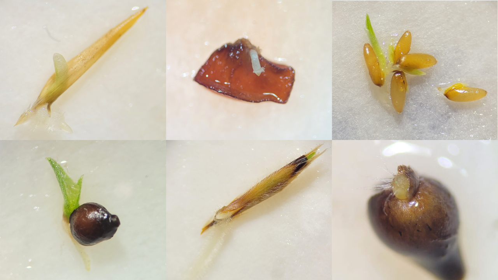
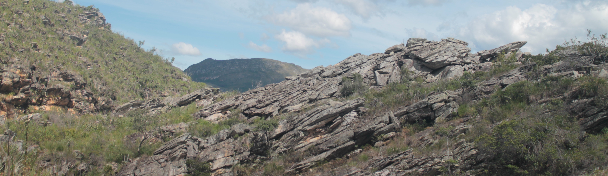

Here you will find information about my academic projects. If you are interested in collaborating or discussing ideas, feel free to [email me](mailto:carlos.ordonez.parra@gmail.com)!

### To germinate or not to germinate: risk-reducing strategies meet seed germination traits (2023–ongoing)

<figure class="project-figure">
  
  <figcaption>
    Germinating seeds from emblematic families of the Brazilian Cerrado.
  </figcaption>
</figure>

Seed ecologists propose that strong evolutionary pressures shape germination so that it occurs under conditions favourable for seedling establishment and survival. However, germination traits have been largely overlooked in plant ecological strategy theory, a key framework for understanding how plant species persist across environments through different trait combinations. During my PhD, I am exploring how germination traits are coordinated with other plant traits known to shape ecological strategies. This project combines quantitative synthesis of secondary data with laboratory and field experiments in the Brazilian Cerrado — the largest Neotropical savanna and one of the most species-rich savannas in the world.

### Rock n' Seeds: an ecological synthesis of seed germination in rock outcrop vegetation (2020–2024)

<figure class="project-figure">
  
  <figcaption>
    Quartzitic outcrops at Serra do Cipó, Minas Gerais, Brazil.
  </figcaption>
</figure>

As part of my master’s dissertation, I compiled a database of 16 seed functional traits from Brazilian rock outcrop vegetation, including ecosystems locally known as <em>campo rupestre</em>, <em>canga</em>, <em>campo de altitude</em> and inselbergs. This database was published as a [data paper](https://esajournals.onlinelibrary.wiley.com/doi/abs/10.1002/ecy.3852) in <em>Ecology</em>. Using this database, I led [the first quantitative synthesis](https://doi.org/10.1093/aob/mcae160) of seed ecology in these ecosystems, focusing on the phylogenetic structure of seed traits and germination responses to different abiotic factors.

Because rock outcrops are geological formations found across climates and continents, we plan to expand our database and quantitative synthesis to rock outcrop vegetation worldwide.

### MelastomaTraits: a trait database for the Melastomataceae family, a megadiverse tropical clade (2020–2024)

<figure class="project-figure">
  
  <figcaption>
    <em>Meriania longifolia</em> (Melastomataceae) at the campus of Pontificia Universidad Javeriana, Bogotá D.C., Colombia.
  </figcaption>
</figure>

Melastomataceae is among the ten largest botanical families in the world, and it is widely recognised for its remarkable morphological and functional diversity. In this project, we compiled a database of plant traits from different organs, including leaves, flowers, fruits and seeds, based on data collected for several chapters of the book [_Systematics, Evolution, and Ecology of Melastomataceae_](https://link.springer.com/book/10.1007/978-3-030-99742-7). The database is available as a [data paper](https://doi.org/10.1002/ecy.4308).

