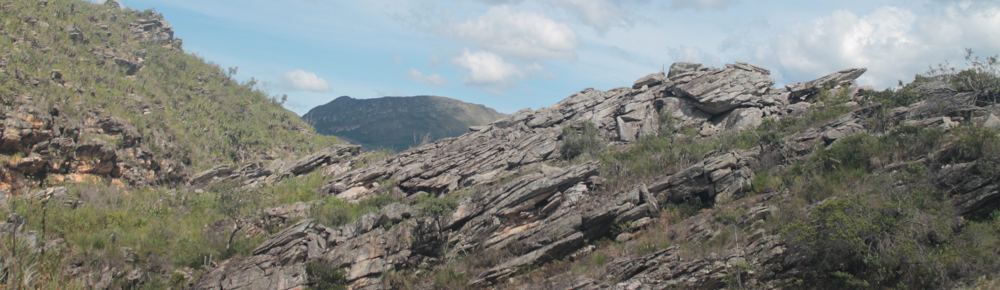

 
Here you'll find information about my academic projects. If you are interested in collaborating or discussing some ideas, feel free to [e-mail me](mailto:carlos.ordonez.parra@gmail.com)!
  

### Rock n' Seeds: an ecological synthesis of seed germination in rock outcrop vegetation (2020 - Ongoing)

 

<figure>
  
  <figcaption> _The campo rupestre at Serra do Cipó (Minas Gerais, Brazil)._ </figcaption>
</figure> 

 

As part of my Master's Dissertation, I compiled a database of 16 seed functional traits from Brazilian rock oucrop vegetation -including ecosystems locally known as _campo rupestre_, _canga_, _campo de altitude_ and inselbergs- that has been published as a [data paper](https://esajournals.onlinelibrary.wiley.com/doi/abs/10.1002/ecy.3852) in _Ecology_. With this database, I've been working on a quantitative synthesis of seed ecology in these ecosystems, focusing on the phylogenetic structure of seed traits and germination responses to different abiotic factors. We hope to submit this paper in early 2023.

In the future, we plan to expand our database and quantitative synthesis to other rock outcrop vegetation worldwide.

 

### MelastomaTraits: a trait database for the Melastomataceae family, a megadiverse tropical clade (2020 - Ongoing)

 

<figure>
  
  <figcaption> _Meriania longifolia at the campus of Pontificia Universidad Javeriana (Bogotá D.C., Colombia)._ </figcaption>
</figure> 

 

The Melastomataceae family is among the ten largest botanical families in the world, and its widely recognized for its wide morphological and functional diversity. In this project, we compile a database of plant traits from different organs, including leaves, flowers, fruits and seeds, based on data collected for various chapters of the recent publication [_Systematics, Evolution, and Ecology of Melastomataceae_](https://link.springer.com/book/10.1007/978-3-030-99742-7). We hope to publish this database by mid-2023.

 