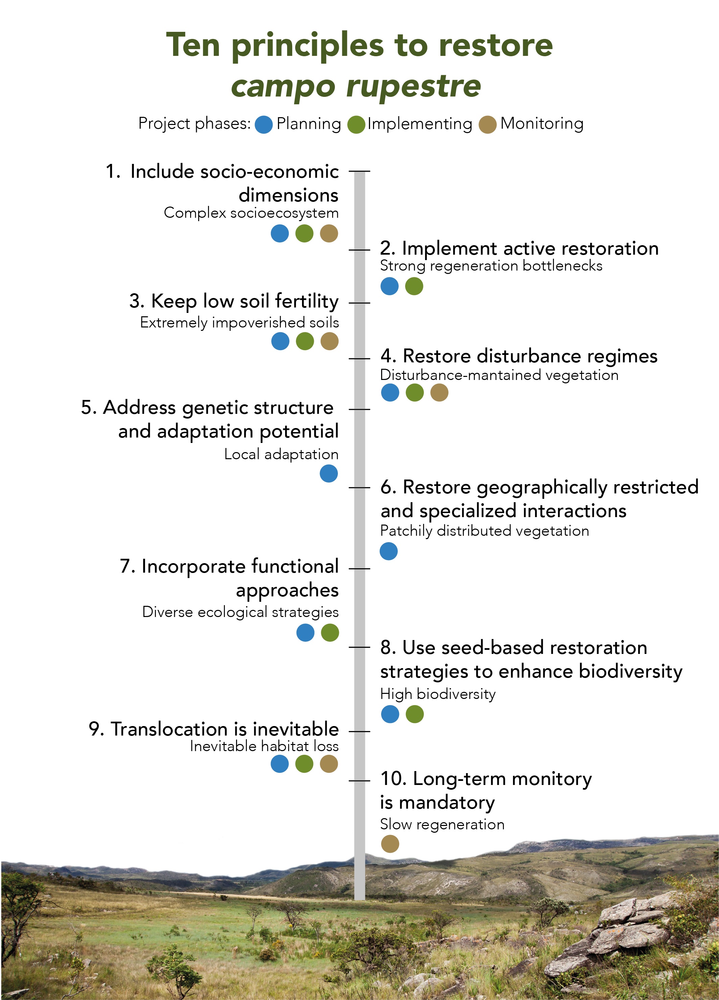
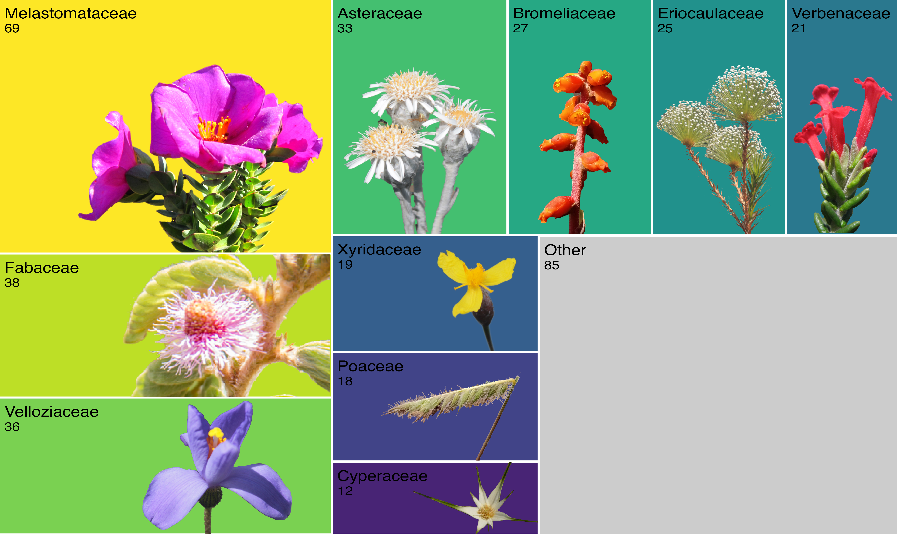
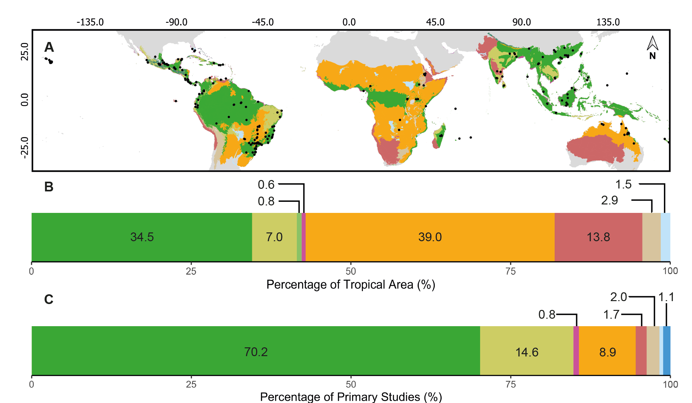
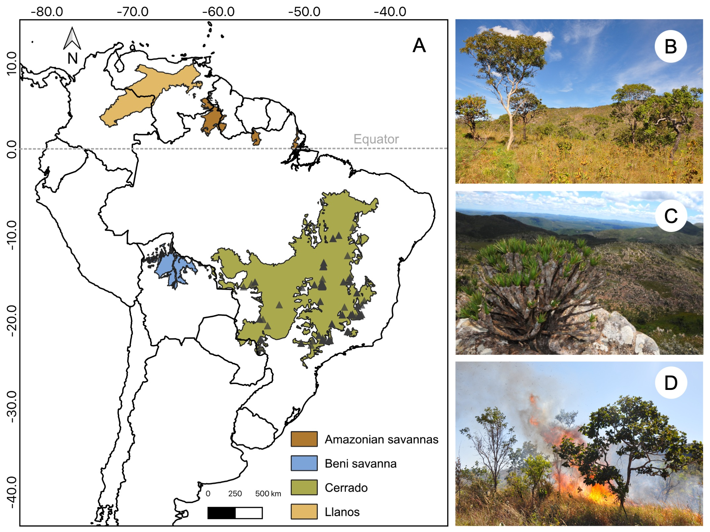

Here you will find an updated list of my publications (last update, April 2024). If you can't access any of these resources, feel free to [e-mail me](mailto:carlos.ordonez.parra@gmail.com) or request a PDF through my [ResearchGate profile](https://www.researchgate.net/profile/Carlos-Ordonez-Parra)!
  

### Preprints

> **Ordóñez-Parra CA**, Medeiros NF, Dayrell RLC, Le Stradic S, Negreiros D, Cornelissen T & Silveira FAO (2023) [Seed functional ecology in Brazilian rock outcrop vegetation: an integrative synthesis](https://www.biorxiv.org/content/10.1101/2023.03.21.533674v2). _bioRxiv_, https://doi.org/10.1101/2023.03.21.533674

### Accepted

> Reginato M†, **Ordóñez-Parra CA†**, Messeder JVS, Brito VLG, Dellinger A, Kriebel R, ... & Silveira FAO (2024) MelastomaTRAITs 1.0: a database of functional traits in Melastomataceae, a large pantropical Angiosperm family. _Ecology_. († Co-first authors)

### Peer-reviewed Papers

> Medeiros NF, **Ordóñez‐Parra CA**, Buisson E & Silveira FAO (2024). [Systematic review of field research reveals critical shortfalls for restoration of tropical grassy biomes](https://doi.org/10.1111/1365-2664.14640). _Journal of Applied Ecology_.

> Silveira FAO, Fuzessy L, Phartyal SS, Dayrell RLC, Vandelook F, Vázquez-Ramírez J, ... & Saatkamp A (2024) [Overcoming major barriers in seed ecology research in developing countries](https://doi.org/10.1017/S0960258523000181). _Seed Science Research_, 33(3), 172 - 181.

> Arruda AJ, Medeiros NF, Fiorini CF, **Ordóñez-Parra CA**, Dayrell RLC, Messeder JVS, ... & Silveira FAO (2023) [Ten principles for restoring campo rupestre, a threatened tropical, megadiverse, nutrient-impoverished montane grassland](https://doi.org/10.1111/rec.13924). _Restoration Ecology_, e13924.

<figure>
  
  <figcaption> _Figure summarizing the ten principles presented in the paper._ </figcaption>
</figure> 

 

> **Ordóñez‐Parra CA**, Dayrell RLC, Negreiros D, Andrade AC, Andrade LG, Antonini Y, ... & Silveira FAO (2022). [Rock n’ Seeds: A database of seed functional traits and germination experiments from Brazilian rock outcrop vegetation](https://esajournals.onlinelibrary.wiley.com/doi/abs/10.1002/ecy.3852). _Ecology_, 104(1), e3852.

<figure>
  
  <figcaption> _Figure 2 in the datapaper metadata showing the ten families with most species in the dataset._ </figcaption>
</figure> 

 

> Toone TA, Ahler SJ, Larson JE, Luong JC, Martínez‐Baena F, **Ordóñez‐Parra CA**, ... & van der Ouderaa IB (2022). [Inclusive restoration: Ten recommendations to support LGBTQ+ researchers in restoration science](https://onlinelibrary.wiley.com/doi/abs/10.1111/rec.13743). _Restoration Ecology_, 31(3) e13743.

> Silveira FAO, **Ordóñez‐Parra CA**, Moura LC, Schmidt IB, Andersen AN, Bond W, ... & Pennington RT (2022). [Biome Awareness Disparity is BAD for tropical ecosystem conservation and restoration](https://besjournals.onlinelibrary.wiley.com/doi/10.1111/1365-2664.14060). _Journal of Applied Ecology_, 59(8), 1967-1975.

<figure>
  
  <figcaption> _Figure 2 in Silveira et al. (2022) showing the disparity between empirical research and biome area._ </figcaption>
</figure> 

 

### Book Chapters

> **Ordóñez-Parra CA**, Messeder JVS, Mancipe-Murillo C, Calderón-Hernández M, & Silveira FAO (2022). [Seed Germination Ecology in Neotropical Melastomataceae: Past, Present, and Future](https://link.springer.com/chapter/10.1007/978-3-030-99742-7_32). In: Goldenberg R, Michelangeli FA, Almeda F, eds. _Systematics, Evolution, and Ecology of Melastomataceae_. Springer, Cham., 707-733.

> Daibes LF, **Ordóñez-Parra CA**, Dayrell RLC, Silveira FAO (2022). [Regeneration from seeds in South American savannas, in particular the Brazilian Cerrado](https://www.sciencedirect.com/science/article/pii/B9780128237311000020?via%3Dihub) In: Baskin CC, Baskin JM, eds. _Plant Regeneration from Seeds_. Elsevier, 183–197.

<figure>
  
  <figcaption> _Figure 1 in Daibes et al. (2022) showing the records recovered by our literature review._ </figcaption>
</figure> 

 

> Basto S, **Ordóñez-Parra CA**, Contreras S, Díaz Ariza LA, Acero Nitola AM, ... Barrera-Cataño JI (2018). Capítulo 1. Bosque Altoandino. In: Basto S, Moreno AC, Barrera-Cataño JI, eds. [_Restauración ecológica en áreas post-tala de especies exóticas en el Parque Forestal Embalse del Neusa_](https://repository.javeriana.edu.co/handle/10554/44696). Pontificia Universidad Javeriana & Corporación Autónoma Regional de Cundinamarca - CAR, 27-54.

> Tulande E, Moreno AC, Contreras S, Roa-Fuentes LL, **Ordóñez-Parra CA**, .. Basto S (2018). Capítulo 5. Monitoreo a las trayectorias sucesional en áreas post talas del PFEN. In: Basto S. Moreno AC, Barrera-Cataño JI, eds. [_Restauración ecológica en áreas post-tala de especies exóticas en el Parque Forestal Embalse del Neusa_](https://repository.javeriana.edu.co/handle/10554/44696). Pontificia Universidad Javeriana & Corporación Autónoma Regional de Cundinamarca - CAR, 103-152.

> Barrera-Cataño JI, Moreno AC, Contreras S, **Ordóñez-Parra CA**, Díaz Ariza LA, ... Basto S (2018). Capítulo 6. Estrategias de restauración ecológica para zonas post-tala en el PFEN. In: Basto S. Moreno AC, Barrera-Cataño JI, eds. [_Restauración ecológica en áreas post-tala de especies exóticas en el Parque Forestal Embalse del Neusa_](https://repository.javeriana.edu.co/handle/10554/44696). Pontificia Universidad Javeriana & Corporación Autónoma Regional de Cundinamarca - CAR, 155-182.

> Basto S, **Ordóñez-Parra, CA**, Roa-Fuentes, LL, Castillo-Díaz, D, Rivera-Díaz A (2018). Semillas: ¿promueven o limitan la restauración ecológica? In: Pinzón-García P, Aguilar-Garavito M, Quijano M, Sierra J, Rubio JA, eds. _Restauración Ecológica en Colombia: un compromiso de país_. Red Colombiana de Restauración Ecológica & Universidad Católica de Oriente, 357-384.

 
